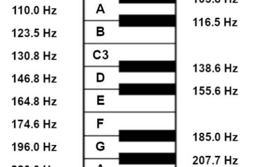

# CPE487 Final Project: Dueling Pianos

### Manavi Panjnani & George Mularadelis

## Introduction

The goal of this project is to create 2 keyboards that each play on one audio channel, allowing users to battle it out on these piano keyboards. In addition to the keyboards, users can also change their octaves as well, allowing them to have more freedom over the songs played.

**Components:**
* Nexys A7-100T Board
* 2 16-button keypad modules
  * Connected to ports JB & JC
* 24-bit digital-to-analog converter (DAC): Pmod I2S
  * Connected to port JA (top 6 pins)
  * 3.5-mm connector for a headphone/speaker needed

Within this project, the keypads and switches act as inputs, and the DAC with the speaker are the outputs of our program. To successfully use these components, we modified the constraints, which are explained in the modifications section.

## Summary

This lab largely builds off files used in labs 4 & 5, which were the calculator & wailing audio signal labs. Below are the different modules that were pulled from these labs and their functions within our project.

The keypad module is the setup used from lab 4, which reads the inputs with the clock process from the keypad. 

The dad_if module is from lab 5, and takes 16-bit parallel stereo data and converts it to the serial format required by the digital to analog converter.
* When L_start is high, a 16-bit left channel data word is loaded into the 16-bit serial shift register SREG on the falling edge of SCLK.
* When L_start goes low, SCLK shifts the data out of SREG, MSBit first to the serial output SDATA at a rate of 1.56 Mb/s.
* Similarly, when R_start goes high, right channel data is loaded into SREG and then shifted out to SDATA.
* Output data changes on the falling edge of SCLK, so that it is stable when the DAC is reading the data on the rising edge of SCLK.

The wail module is from lab 5, and serves as the file in which the audio signal is produced at the correct pitch given the keypad entry. It also takes the input from the switches and changes the octave depending on which switches are active. 

The tone module from lab 5 generates a signed triangular wave (a tone) at a sampling rate of 48.8 KHz.
* The process cnt_pr generates an unsigned sawtooth waveform count by incrementing a 16-bit counter pitch value every clock cycle.
* The frequency with which it traverses the whole 16-bit count range is thus proportional to pitch.
* The lowest possible tone frequency is obtained when pitch=1.
* It then takes 216 or 65,536 cycles to traverse the range of the counter.
* The frequency is then 48.8 kHz / 216 or 0.745 Hz.
 * This was used to calculate the correct keypad outputs within wail.
* A select signal assignment statement is then used to convert the unsigned sawtooth count into a signed triangle wave.
* The sawtooth count is split up into 4 quadrants quad and an index value within the quadrant.
* The signals quad and index are used to generate a triangle wave.

The siren module is from lab 5, and in this project, it acts as our testbench. Within this code, it initializes all of our entities and runs the main clock process to ensure all components are synchronized and can pass information to one another. 

## Modifications

The three main files that needed to be modified for this project were the top-level siren, wail, and constraints file. 
To create our desired constraints file we started from the master constraints file on the board github. Building off of this file we made a few modifications.
* Uncommented the clock, changed it to read at 50MHz
* Uncommented the 4 ports on JA needed to operate the DAC 
* Uncommented the JB and JC ports, and renamed their outputs to function as right and left keyboards respectively
* Uncomment the two leftmost and rightmost switches (15-14, 1-0)

The modifications made to siren aimed to add functionality to the newly added external components, as well as create two instances of left and right audio.
* Add new inputs + outputs to the siren entity (L/R keypads, L/R switches)
* Create a new component for keypad 
* Modify the wail component to receive a keypad value and the switch values
* Create new signals to be used in the siren architecture for keypad processing (keypad clock, L/R values, L/R hit flag)
* Create two instances of the keypad to decode both left and right inputs
* Create a second instance of wail to create the left audio separately, as well as modifying the wail instances to send the newly read keypad and switch values

The wail module was modified in our code to map the keypad value being read to a specific pitch in the western musical scale, and pass that along to the tone module to be created into a signal to be output. 
* Modify the entity to receive keypad and switch values
* Create a new signal “mult,” which will be used to multiply the frequency in order to change octaves (one octave = 2x previous octave frequency)
* Change “mult” based on switch value (mult = 2^sw, 0 <= sw <= 3)
* Change the value of curr_pitch based on whatever keypad value is received 
 * The notes match the western chromatic scale starting on A2

## Conclusions

As only George was able to download Vivado, both members collaborated on all the code aspects and changes needed to be made over the 2 weeks of class. The GitHub readme file was also split between members.
	The first day of working on the project was spent gathering all of the foundational modules we would be using, and incorporating them well enough so that the baseline siren code (which our project was based on) would run without errors with the newly added components. There was some confusion on the addition of the keypad module when noticing that the column values are inputs despite the rows being outputs. We learned after further inspection of the code that this is because the module essentially polls each column for the pressed row to determine what value is being sent.
	The second day working on the project was spent creating the piano functionality. Getting the keypad values into the wail module was easy, but there was an initial bug where we were assigning a value at keypad = x”0”, which was perpetually playing the tone specified at that value. After removing that condition and playing the chromatic scale for keypad values 1-12 the code performed as intended. 
	The last day was spent adding the switch functionality and splitting the left and right audio. The left and right split was simple as creating second instances of wail worked without any issues. There was some debate on what octaves to play when adding the multiplier. We ultimately settled on the octaves containing A2 -> A5 as this is most often the notes used when playing melodies on a real piano. 

---
> "We pledge our Honor that we have abided by the Stevens Honor System." - George Mularadelis, Manavi Panjnani
